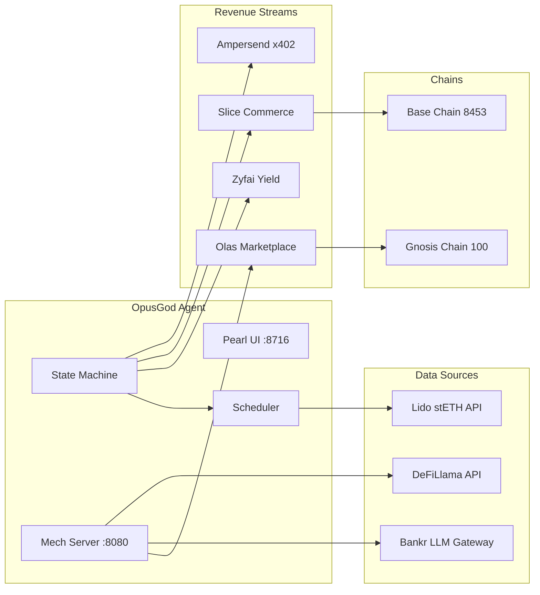
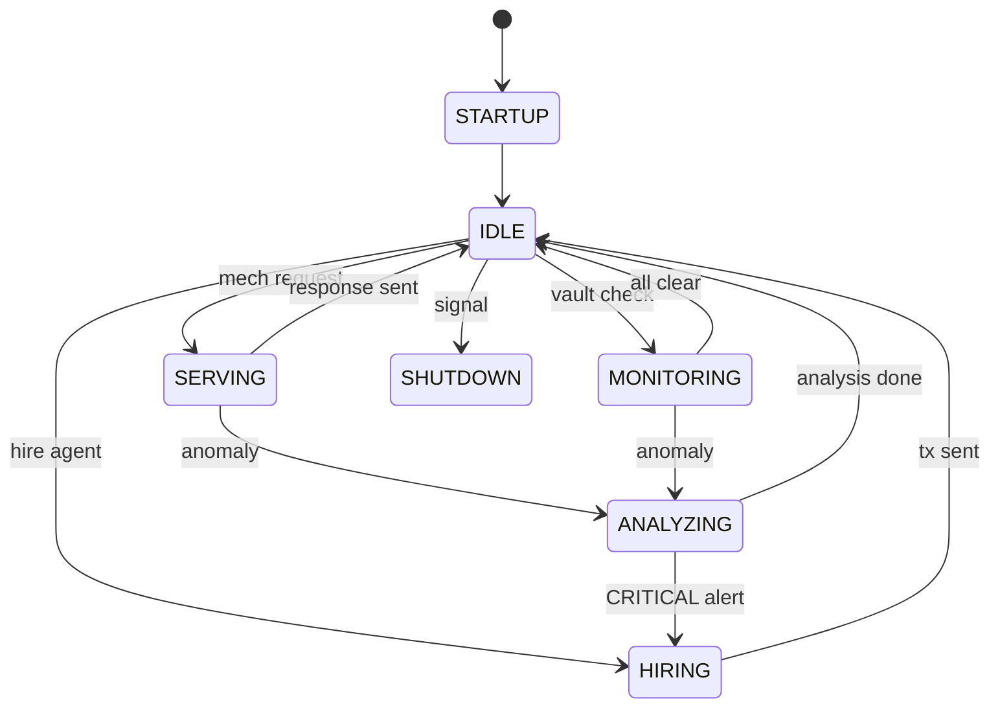

# OpusGod — Autonomous DeFi Intelligence Agent

> **The only agent in this hackathon that earns its own living.**

Every other self-funding DeFi agent is an island. OpusGod is a node in the agent economy — it hires, gets hired, signs every action, and anyone can deploy it. That's not a demo. That's infrastructure.

**Build stats:** 2,600+ lines of source across 25 modules | 105 tests passing | 21 conventional commits | Python 3.10+ async

## The Self-Sustaining Loop

```
Zyfai Yield ──────► EARNS yield on idle capital
     │
     ▼
Treasury ─────────► FUNDS its own operations
     │
     ├──► Bankr LLM Gateway ──► THINKS (multi-model inference)
     ├──► ampersend x402 ──────► PAYS for market data
     ├──► Olas mech-client ────► HIRES specialist agents
     │
     ▼
DeFi Intelligence ► PRODUCES analysis + signals
     │
     ├──► Olas mech-server ────► SELLS to other agents (earns fees)
     ├──► Slice Hooks ─────────► SELLS to humans (dynamic pricing)
     ├──► Telegram ────────────► ALERTS vault monitoring subscribers
     │
     ▼
ERC-8128 + ERC-8004 ► SIGNS every request, PROVES identity on-chain
     │
     ▼
Pearl ─────────────► NON-TECHNICAL USERS can deploy & configure
```

## Thesis

Autonomous agents should not depend on humans for operational funding. OpusGod proves this by selling DeFi analysis on the Olas marketplace, earning yield on idle capital via Zyfai, and pricing services dynamically with Slice hooks. Every HTTP request is cryptographically signed with ERC-8128, linking actions to an on-chain identity. The agent monitors Lido vaults for anomalies, hires other agents for specialist tasks, and auto-escalates on CRITICAL alerts — all without human intervention.

## Tech Stack

| Component | Technology |
|-----------|-----------|
| Language | Python 3.10+, fully async (asyncio) |
| Chains | Gnosis (Olas mech ops) + Base (Slice/ERC-8128) |
| LLM | Bankr LLM Gateway (multi-model: GPT-4o, Claude, Gemini) |
| On-chain | web3.py, eth-account, EIP-191 signing |
| Data | DeFiLlama (live TVL/APY), Lido stETH API |
| Auth | ERC-8128 (RFC 9421 HTTP Message Signatures) — first Python impl |
| Identity | ERC-8004 on-chain receipt |
| Payments | ampersend x402 micropayments |
| Deployment | Pearl (port 8716), Olas mech-server (port 8080) |

## Architecture



## State Machine



## Hackathon Tracks (11)

| # | Track | What OpusGod Does |
|---|-------|-------------------|
| 1 | Olas: Monetize Agent | Exposes 5 DeFi analysis tools via mech-server on Gnosis |
| 2 | Olas: Hire Agent | Hires specialist agents via mech-client with DAG orchestration |
| 3 | Olas: Build for Pearl | Full Pearl dashboard with live P&L, healthcheck, risk controls |
| 4 | ampersend-sdk | x402 HTTP micropayments with EIP-191 signed payment authorization |
| 5 | Bankr LLM Gateway | Multi-model routing (GPT-4o for speed, Claude for strategy) |
| 6 | Vault Position Monitor | Lido stETH monitoring with 3-tier alerts via Telegram |
| 7 | Zyfai Yield Agent | Revenue-funded operations — yield pays for everything |
| 8 | Zyfai Yield Infra | ERC-4337 Safe smart account for self-funding infrastructure |
| 9 | Slice Hooks | Market-aware dynamic pricing (volatility + demand = price) |
| 10 | ERC-8128 Auth | First Python implementation of RFC 9421 HTTP Message Signatures |
| 11 | Synthesis Open | Complete autonomous DeFi economic entity with P&L |

## 5 Mech Tools (DeFiLlama-powered)

All tools fetch real data from DeFiLlama before sending to Bankr LLM for analysis.

1. **yield_optimizer** — Cross-protocol yield comparison with live pool data
2. **risk_assessor** — Protocol risk scoring with real TVL/audit data
3. **vault_monitor** — Vault health monitoring with live APY/TVL
4. **protocol_analyzer** — Protocol safety analysis with DeFiLlama fundamentals
5. **portfolio_rebalancer** — Rebalancing recommendations with real yield opportunities

## Revenue Streams

| Stream | Source | Track | Mechanism |
|--------|--------|-------|-----------|
| Mech Fees | 5 DeFi analysis tools | Olas Monetize | Per-request fees on Gnosis |
| Agent Hiring | Specialist agents | Olas Hire | On-chain mech requests |
| Zyfai Yield | Idle capital | Zyfai | ERC-4337 Safe yield accounts |
| Slice Commerce | Dynamic reports | Slice Hooks | Surge pricing on Base |
| x402 Payments | Premium API | ampersend-sdk | HTTP-native micropayments |

## Quick Start

```bash
pip install -e ".[dev]"
cp .env.example .env
# Fill in your keys in .env
python scripts/fund_agent.py    # Check wallet balances
python scripts/register_mech.py # Register tools
python -m src.agent.core        # Start agent
```

## Endpoints

| Port | Service | Endpoints |
|------|---------|-----------|
| 8716 | Pearl UI | `GET /` `GET /healthcheck` `GET /funds-status` `GET /metrics` |
| 8080 | Mech Server | `POST /request` `GET /tools` `GET /health` |

## ERC-8128: First Python Implementation

OpusGod includes the first Python package for ERC-8128 HTTP Message Signatures. Every API request is cryptographically signed with the agent's Ethereum key per RFC 9421, creating a verifiable link between HTTP actions and on-chain identity.

## Project Structure

```
olas-defi-agent/
├── config/
│   ├── settings.py          # Pydantic settings (all env vars)
│   ├── chains.py            # Gnosis + Base chain configs
│   └── tracks.json          # 11 track metadata
├── src/
│   ├── agent/
│   │   ├── core.py          # Main agent loop + 7-state machine (432 lines)
│   │   ├── state.py         # AgentState enum + transitions
│   │   └── scheduler.py     # Periodic task scheduler
│   ├── mech/
│   │   ├── server.py        # Olas mech-server (HTTP + on-chain events)
│   │   ├── client.py        # Olas mech-client (hire agents via web3 txs)
│   │   └── tools.py         # 5 DeFi analysis tools (DeFiLlama + Bankr)
│   ├── integrations/
│   │   ├── bankr.py         # Multi-model LLM client with cost tracking
│   │   ├── lido.py          # Lido vault monitor with anomaly detection
│   │   ├── zyfai.py         # Zyfai yield self-funding operations
│   │   ├── slice_hook.py    # Dynamic pricing hook on Base
│   │   ├── telegram.py      # Alert sender with rate limiting
│   │   ├── ampersend.py     # x402 HTTP payment protocol
│   │   └── erc8128.py       # RFC 9421 HTTP Message Signatures
│   ├── analysis/
│   │   ├── defi_analyzer.py # DeFiLlama + Bankr analysis engine
│   │   ├── vault_scorer.py  # Multi-factor vault risk/yield scoring
│   │   └── market_signal.py # Signal aggregation + sentiment
│   ├── onchain/
│   │   ├── gnosis.py        # Gnosis Chain client (POA, nonce locking)
│   │   ├── base.py          # Base Chain client
│   │   └── contracts.py     # Mech + ERC-20 ABIs + addresses
│   └── pearl/
│       └── compat.py        # Pearl HTTP dashboard (port 8716)
├── scripts/
│   ├── register_mech.py     # Register 5 tools on Olas marketplace
│   ├── fund_agent.py        # Check wallet balances + faucet links
│   └── deploy_slice_hook.py # Deploy pricing hook on Base
└── tests/                   # 19 test files, 105 tests passing
```

## Testing

```bash
pip install -e ".[dev]"
python -m pytest tests/ -v   # 105 tests, ~11s
```

## License

Apache-2.0
