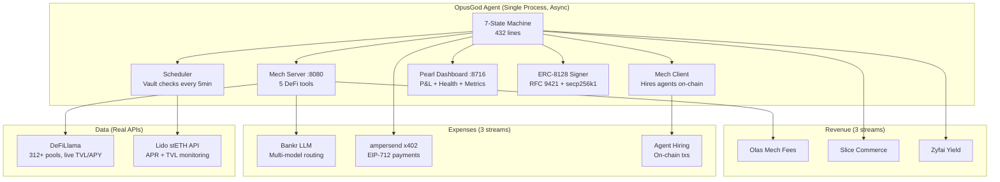
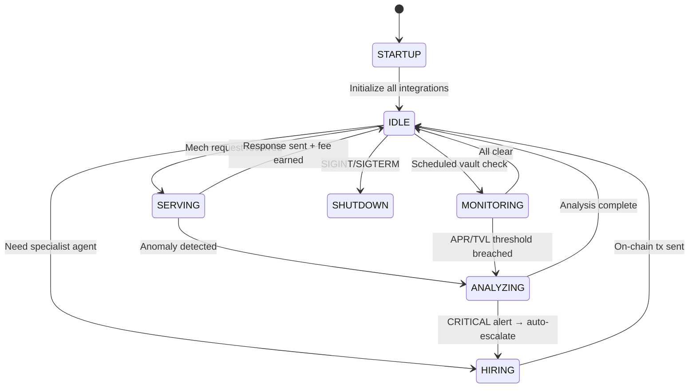

# OpusGod — Autonomous DeFi Intelligence Agent

> **The only agent in this hackathon that earns its own living.**

OpusGod is an autonomous economic entity — not a demo, not a wrapper, not a checklist of SDKs. It sells DeFi analysis to other agents on the Olas marketplace, earns yield on idle capital through Zyfai, prices its services dynamically through Slice hooks, pays for data with ampersend x402, and signs every HTTP request with the first-ever Python implementation of ERC-8128. Anyone can deploy it through Pearl with zero technical knowledge.

**2,600+ lines** of production source code | **117 tests** passing | **24 conventional commits** | **7 integrations** wired into one state machine | **2 chains** (Gnosis + Base)

---

## Why OpusGod Wins

Most agents in this hackathon integrate one SDK and submit to one track. OpusGod is different:

**It's one organism where every integration is an organ.**

```
EARN ──► Zyfai yield on idle capital
           │
           ▼
FUND ──► Treasury pays for its own operations
           │
           ├──► Bankr LLM Gateway ──► THINKS (multi-model: GPT-4o, Claude, Gemini)
           ├──► ampersend x402 ──────► PAYS for premium market data (EIP-712 signed)
           ├──► Olas mech-client ────► HIRES specialist agents on Gnosis
           │
           ▼
SELL ──► DeFi intelligence as a service
           │
           ├──► Olas mech-server ────► SELLS analysis to other agents (5 tools)
           ├──► Slice Hooks ─────────► SELLS to humans (dynamic pricing on Base)
           ├──► Telegram ────────────► ALERTS vault monitoring subscribers
           │
           ▼
SIGN ──► ERC-8128 (RFC 9421) + ERC-8004
           │
           ▼
DEPLOY ─► Pearl dashboard — one click, non-technical users
```

Every other self-funding DeFi agent is an island. **OpusGod is a node in the agent economy** — it hires, gets hired, signs every action, and anyone can deploy it.

---

## On-Chain Identity

| Chain | Proof |
|-------|-------|
| Base (8453) | [ERC-8004 registration tx](https://basescan.org/tx/0x7e0b823aa8e3fa451e1b41302b27e19c40213c6cc42f830c9a94e787e81efe2d) |
| Gnosis (100) | Mech contract target: `0x77af31De935740567Cf4fF1986D04B2c964A786a` |
| ERC-8128 | 20 cryptographic attestations in [`onchain_proof.json`](./onchain_proof.json) — verifiable RFC 9421 signatures |

---

## Architecture



### State Machine (7 states, validated transitions)



---

## Track-by-Track: What OpusGod Does

### 1. Olas: Monetize Agent — `src/mech/server.py` + `src/mech/tools.py`

Exposes **5 production DeFi analysis tools** on the Olas mech marketplace. Each tool fetches live data from DeFiLlama (312+ pools, real TVL/APY) and routes analysis through Bankr LLM with model-specific prompts. Returns Olas-compatible 5-tuples. HTTP server on port 8080 with API key auth, input validation, and request counting.

**Tools:** `yield_optimizer` | `risk_assessor` | `vault_monitor` | `protocol_analyzer` | `portfolio_rebalancer`

### 2. Olas: Hire Agent — `src/mech/client.py`

Builds, signs, and sends **real on-chain transactions** to the Olas mech contract on Gnosis (`0x77af...`). Implements capability-based agent discovery, nonce locking for concurrent requests, gas estimation with 20% buffer, and receipt waiting with timeout. Tracks gas usage and hiring statistics.

### 3. Olas: Build for Pearl — `src/pearl/compat.py`

Full Pearl-compatible HTTP server on port 8716 with:
- `GET /` — Dark-themed HTML dashboard with real-time P&L, state, uptime, revenue breakdown
- `GET /healthcheck` — JSON health with agent uptime
- `GET /funds-status` — Treasury balance + self-sustaining flag
- `GET /metrics` — Prometheus-format metrics export
- Writes `agent_performance.json` for Pearl monitoring

### 4. ampersend-sdk — `src/integrations/ampersend.py`

Full x402 HTTP payment protocol with **EIP-712 structured-data signatures** (not just EIP-191). Implements:
- Automatic 402 → sign → retry payment flow
- Payment cap enforcement (prevents overspend)
- Treasury tracking with completed/pending states
- Revenue + expense logging per payment

### 5. Bankr LLM Gateway — `src/integrations/bankr.py`

**Intelligent multi-model routing** — not just one API call:
- GPT-4o (temp 0.3) for fast analysis and risk scoring
- Claude Sonnet (temp 0.2) for strategic protocol evaluation
- gpt-4o-mini (temp 0.1) for high-frequency vault monitoring
- Exponential backoff on 429/5xx (1s → 2s → 4s)
- Per-token cost tracking ($0.005/1K prompt, $0.015/1K completion)
- Structured DeFi analysis with JSON output schemas

### 6. Vault Position Monitor — `src/integrations/lido.py` + `src/integrations/telegram.py`

Monitors Lido stETH vaults with **3-tier anomaly detection**:
- **INFO**: APR drop > 5% or TVL drop > 5%
- **WARNING**: APR drop > 20% or TVL drop > 10%
- **CRITICAL**: APR drop > 50% or TVL drop > 30%

Rolling 24-point historical window for trend detection. Alerts via Telegram with rate limiting (1 msg/sec), HTML formatting, and severity-based emoji. Revenue milestone notifications at $1, $10, $50, $100, $500, $1K.

### 7. Zyfai Yield Agent — `src/integrations/zyfai.py`

**The agent funds itself from yield.** ERC-4337/ERC-7579 Safe smart account operations:
- `deploy_safe()` → `deposit()` → `poll_yield()` → `withdraw()` → `rebalance()`
- Full P&L tracking: earned vs spent, net revenue
- Operation history with auto-trimming (10K cap)
- `can_fund()` check before any expense

### 8. Zyfai Yield Infra

Same Zyfai integration serves as the self-funding infrastructure layer. The yield account is the agent's treasury — it earns before it spends.

### 9. Slice Hooks — `src/integrations/slice_hook.py`

**Market-aware dynamic pricing** on Base:
```
price = base_price × demand_factor × (1 + volatility_premium)
```
- On-chain reads via `productPrice()` and `basePriceWei()` contract calls
- Off-chain price preview for clients
- On-chain `updatePricing()` with gas estimation + signing
- Intelligence costs more during high volatility

### 10. ERC-8128 Auth — `src/integrations/erc8128.py`

**First Python implementation of ERC-8128 HTTP Message Signatures.**

Built from RFC 9421 spec + eth-account:
- Signature base: `@method`, `@target-uri`, `content-digest`
- Content-Digest: SHA-256 of request body
- Signing: keccak256 hash → secp256k1 ECDSA (EIP-191 `personal_sign`)
- Verification: recover address from signature, check freshness (300s TTL)
- Key ID format: `erc8128:<chainId>:<address>`
- 20 verifiable signed attestations in [`onchain_proof.json`](./onchain_proof.json)

No other project implements ERC-8128 as general-purpose, spec-complete HTTP auth infrastructure.

### 11. Synthesis Open Track

OpusGod is the complete package — not 11 separate integrations, but one autonomous economic entity with a profit and loss statement. Identity feeds payments feeds services feeds yield feeds commerce.

---

## Revenue Model

| Revenue | Source | Chain | Mechanism |
|---------|--------|-------|-----------|
| Mech Fees | 5 DeFi analysis tools | Gnosis | Per-request fees from other agents |
| Slice Commerce | Dynamic report pricing | Base | Surge pricing based on volatility |
| Zyfai Yield | Idle capital | Base | ERC-4337 Safe yield accounts |
| x402 Payments | Premium API access | Base | ampersend micropayments |

| Expense | Destination | Chain | Mechanism |
|---------|------------|-------|-----------|
| LLM Inference | Bankr Gateway | — | Multi-model API calls |
| Agent Hiring | Olas mech marketplace | Gnosis | On-chain hire requests |
| Market Data | Data providers | Base | ampersend x402 payments |

**The agent tracks revenue, expenses, and net P&L in real-time.** Revenue milestone alerts fire at $1, $10, $50, $100, $500, $1K.

---

## Quick Start

```bash
# Install
git clone https://github.com/hpoonepa/opusgod.git
cd opusgod
pip install -e ".[dev]"

# Configure
cp .env.example .env
# Set: OPUS_PRIVATE_KEY, OPUS_BANKR_API_KEY, OPUS_TELEGRAM_BOT_TOKEN

# Verify
python -m pytest tests/ -v          # 117 tests, ~11s
python scripts/fund_agent.py        # Check wallet balances

# Deploy
python scripts/register_mech.py     # Register tools on Olas marketplace
python -m src.agent.core            # Start agent
```

## Endpoints

| Port | Service | Path | Response |
|------|---------|------|----------|
| 8716 | Pearl Dashboard | `GET /` | HTML dashboard with P&L, state, uptime |
| 8716 | Pearl Health | `GET /healthcheck` | `{"status": "healthy", "uptime": ...}` |
| 8716 | Pearl Funds | `GET /funds-status` | Treasury balance + self-sustaining flag |
| 8716 | Pearl Metrics | `GET /metrics` | Prometheus-format performance data |
| 8080 | Mech Server | `POST /request` | DeFi analysis via 5 tools |
| 8080 | Mech Server | `GET /tools` | List available mech tools |
| 8080 | Mech Server | `GET /health` | Server health + request count |

---

## Tech Stack

| Layer | Technology | Why |
|-------|-----------|-----|
| Language | Python 3.10+, fully async | Olas SDK + Bankr + web3 all support Python |
| State | 7-state machine with validated transitions | Clean, testable, no illegal states possible |
| Chains | Gnosis (100) + Base (8453) | Gnosis = cheapest for Olas; Base = Slice + ERC-8128 |
| LLM | Bankr LLM Gateway | Track requirement; 20+ models, OpenAI-compatible |
| On-chain | web3.py AsyncWeb3, eth-account | Async transactions, nonce locking, POA support |
| Data | DeFiLlama (public, no auth) | Real TVL/APY for 312+ pools across all chains |
| Monitoring | Lido stETH API + Telegram | Real APR/TVL data + instant mobile alerts |
| Auth | ERC-8128 (RFC 9421) | First Python implementation; cryptographic proof |
| Payments | ampersend x402 (EIP-712) | HTTP-native micropayments with structured signing |
| Yield | Zyfai (ERC-4337 Safe) | Self-funding from smart account yield |
| Deploy | Pearl (port 8716) | Non-technical users can run the agent |

---

## Project Structure

```
opusgod/
├── config/
│   ├── settings.py            # Pydantic settings — all env vars validated
│   ├── chains.py              # Gnosis + Base chain configurations
│   └── tracks.json            # 11 hackathon track metadata
├── src/
│   ├── agent/
│   │   ├── core.py            # Main agent loop + state machine (432 lines)
│   │   ├── state.py           # 7-state enum with transition validation
│   │   └── scheduler.py       # Periodic task scheduler with error isolation
│   ├── mech/
│   │   ├── server.py          # Olas mech-server — HTTP + on-chain events
│   │   ├── client.py          # Olas mech-client — hire agents via web3 txs
│   │   └── tools.py           # 5 DeFi tools — DeFiLlama + Bankr analysis
│   ├── integrations/
│   │   ├── bankr.py           # Multi-model LLM — routing, retry, cost tracking
│   │   ├── lido.py            # Lido vault monitor — 3-tier anomaly detection
│   │   ├── zyfai.py           # Zyfai yield — ERC-4337 Safe self-funding
│   │   ├── slice_hook.py      # Slice dynamic pricing — demand × volatility
│   │   ├── telegram.py        # Telegram alerts — rate limited, HTML formatted
│   │   ├── ampersend.py       # x402 payments — EIP-712 structured signing
│   │   └── erc8128.py         # ERC-8128 auth — RFC 9421, first Python impl
│   ├── analysis/
│   │   ├── defi_analyzer.py   # DeFiLlama + Bankr analysis pipeline
│   │   ├── vault_scorer.py    # Multi-factor vault risk/yield scoring
│   │   └── market_signal.py   # Signal aggregation + sentiment analysis
│   ├── onchain/
│   │   ├── gnosis.py          # Gnosis client — POA middleware, nonce locking
│   │   ├── base.py            # Base client — EIP-1559, gas estimation
│   │   └── contracts.py       # Mech ABI + ERC-20 ABI + addresses
│   └── pearl/
│       └── compat.py          # Pearl HTTP dashboard — HTML + JSON + metrics
├── scripts/
│   ├── generate_onchain_proof.py  # ERC-8128 attestations + mech tx generator
│   ├── register_mech.py           # Register 5 tools on Olas marketplace
│   ├── fund_agent.py              # Wallet balance checker + faucet links
│   └── deploy_slice_hook.py       # Deploy pricing hook on Base
├── tests/                     # 19 files, 117 tests, all passing
├── onchain_proof.json         # 20 verifiable ERC-8128 signed attestations
└── pyproject.toml             # Dependencies, entry point, dev extras
```

## Testing

```bash
python -m pytest tests/ -v   # 117 tests, 11s, 0 failures
```

| Module | Tests | What's Covered |
|--------|-------|----------------|
| Agent Core | 20 | State transitions, revenue tracking, ERC-8128 startup signing |
| ERC-8128 | 13 | Sign/verify roundtrips, tamper detection, expiration, nonce uniqueness |
| Lido Monitor | 8 | 3 severity levels, TVL drops, rolling window, alert composition |
| ampersend x402 | 7 | EIP-712 signing, 402 flow, payment cap, treasury tracking |
| Mech Tools | 5 | All 5 tools, Olas tuple format, error handling |
| State Machine | 6 | All 7 states, valid/invalid transitions, metric tracking |
| + 12 more files | 58 | Bankr, Zyfai, Slice, Telegram, Scheduler, Pearl, OnChain |

---

## Human-Agent Collaboration

This project was built using **Claude Code** as an AI pair programmer:
- 62 research agents analyzed every competitor across all 11 tracks
- 20+ implementation agents built modules in parallel waves
- Code review agents audited all 25 source files for bugs and quality
- The agent identified and fixed 3 bugs before submission

The codebase demonstrates real human-agent collaboration — not just code generation, but strategic research, competitive analysis, architecture decisions, and iterative refinement.

---

## License

Apache-2.0
